# SOC POC with LangGraph

## 🔒 Intelligent Security Operations Center - Multi-Agent Workflow System

An advanced Security Operations Center (SOC) proof-of-concept built on LangGraph, featuring autonomous AI agents for alert processing, threat analysis, and incident response. This system demonstrates how modern AI can enhance security operations through intelligent automation, human-AI collaboration, and continuous learning.

## 🏗️ Architecture Overview

The SOC POC implements a sophisticated multi-layered architecture designed for scalability, reliability, and intelligent decision-making:

### Core Framework
- **State Management**: Centralized state handling with versioning and audit trails
- **Workflow Engine**: LangGraph-powered orchestration for complex multi-agent workflows
- **Configuration**: Dynamic policy-driven configuration management

### Agent Ecosystem
Six specialized AI agents working in harmony:

1. **Ingestion Agent** - Multi-source alert collection with deduplication
2. **Triage Agent** - Intelligent alert prioritization and initial classification  
3. **Analysis Agent** - Deep threat investigation using ReAct reasoning loops
4. **Human-in-the-Loop** - Structured analyst collaboration and escalation
5. **Response Agent** - Automated containment and remediation actions
6. **Learning Agent** - Continuous model improvement and knowledge extraction

### Tool Orchestration Layer
Unified interface to security tools:
- **SIEM Integration** - Splunk, QRadar, Sentinel connectivity
- **Threat Intelligence** - IOC enrichment and reputation services
- **Sandbox Analysis** - Automated malware detonation
- **EDR/XDR Tools** - Endpoint investigation and response

## 🚀 Key Features

### Intelligent Decision Making
- **Confidence-Based Routing** - Alerts flow through agents based on confidence thresholds
- **Policy-Driven Workflows** - Configurable decision points with business logic
- **Adaptive Thresholds** - Dynamic adjustment based on historical performance

### Advanced State Management
```python
Enhanced State Object:
├── alert_id & raw_alert
├── enriched_data & triage_status  
├── confidence_score & FP/TP_indicators
├── workflow_history & agent_executions
├── human_feedback & response_actions
└── metadata & audit_trail
```

### Asynchronous Processing
- **Concurrent Tool Execution** - Parallel security tool queries
- **Retry Mechanisms** - Robust error handling and fallback strategies
- **Caching Layer** - Redis-powered performance optimization
- **Rate Limiting** - API protection and resource management

### Human-AI Collaboration
- **Structured Feedback Interface** - Clear escalation and review processes
- **Role-Based Access Control** - Analyst, senior analyst, and manager workflows
- **SLA Tracking** - Response time monitoring and alerting
- **Knowledge Transfer** - Human insights fed back to learning systems

## 🔄 Workflow Process

```mermaid
graph TD
    %% Enhanced State Definition
    State[<b>Enhanced State Object</b><br/>• alert_id<br/>• raw_alert<br/>• enriched_data<br/>• triage_status<br/>• confidence_score<br/>• FP/TP_indicators<br/>• workflow_history<br/>• agent_executions<br/>• human_feedback<br/>• response_actions<br/>• metadata]
    
    %% Enhanced Nodes with Async Support
    Ingestion[<b>Ingestion Agent</b><br/>• Async Sources<br/>• Batching<br/>• Deduplication<br/>• Rate Limiting]
    Triage[<b>Triage Agent</b><br/>• Rule Engine<br/>• ML Scoring<br/>• Thresholds<br/>• Fallback]
    Correlation[<b>Correlation Agent</b><br/>• Async Queries<br/>• Caching<br/>• Timeouts<br/>• Retry Logic]
    Analysis[<b>Analysis Agent</b><br/>• ReAct Loop<br/>• Tool Orchestration<br/>• Fallback to Human<br/>• Reasoning Logs]
    HumanLoop[<b>Human-in-the-Loop</b><br/>• Structured Feedback<br/>• Role-Based Access<br/>• Escalation Levels<br/>• SLA Tracking]
    Response[<b>Response Agent</b><br/>• Playbook Engine<br/>• Approval Workflow<br/>• Rollback Support<br/>• Action Audit]
    Learning[<b>Learning Agent</b><br/>• Model Versioning<br/>• Training Pipeline<br/>• Performance Metrics<br/>• A/B Testing]
    Close[<b>Close Alert</b><br/>• State Validation<br/>• Audit Trail<br/>• Archive Process<br/>• Metrics Collection]
    
    %% Enhanced Decision Points with Thresholds
    IsFP{Confidence > 80%<br/>AND FP Indicators?<br/>Policy: FP_THRESHOLD}
    NeedsCorrelation{Confidence 40-70%<br/>OR Needs Context?<br/>Policy: CORRELATION_POLICY}
    NeedsAnalysis{Confidence < 60%<br/>OR Complex Alert?<br/>Policy: ANALYSIS_POLICY}
    NeedsHuman{Confidence Grey Zone<br/>OR High Risk?<br/>Policy: HUMAN_REVIEW_POLICY}
    NeedsResponse{Confirmed Threat<br/>AND Auto-Response<br/>Enabled?<br/>Policy: RESPONSE_POLICY}
    
    %% Enhanced Tool Orchestration
    Tools[<b>Tool Orchestration Layer</b><br/>• Async Execution<br/>• Retry Strategies<br/>• Caching Layer<br/>• Metrics Collection<br/>• Timeout Handling<br/>• Fallback Logic]
    
    %% Storage Layer
    Storage[<b>Storage Layer</b><br/>• PostgreSQL<br/>• Redis Cache<br/>• Vector DB<br/>• State History<br/>• Audit Logs]
    
    %% Monitoring & Observability
    Monitoring[<b>Monitoring & Observability</b><br/>• Metrics<br/>• Tracing<br/>• Logging<br/>• Alerts<br/>• Dashboards]
    
    %% Enhanced Flow with Async and Feedback Loops
    Ingestion -->|Initialize State| State
    State -->|New Alert| Triage
    Triage -->|Update State| State
    State -->|Triage Complete| IsFP
    IsFP -->|Yes| Close
    IsFP -->|No| NeedsCorrelation
    NeedsCorrelation -->|Yes| Correlation
    NeedsCorrelation -->|No| NeedsAnalysis
    Correlation -->|Update State| State
    State -->|Correlation Complete| NeedsAnalysis
    NeedsAnalysis -->|Yes| Analysis
    NeedsAnalysis -->|No| NeedsHuman
    Analysis -->|ReAct Loop| State
    State -->|Analysis Complete| NeedsHuman
    NeedsHuman -->|Yes| HumanLoop
    NeedsHuman -->|No| NeedsResponse
    HumanLoop -->|Update State| State
    State -->|Human Feedback| NeedsResponse
    NeedsResponse -->|Yes| Response
    NeedsResponse -->|No| Learning
    Response -->|Update State| State
    State -->|Response Complete| Learning
    Learning -->|Update State| State
    State -->|Learning Complete| Close
    
    %% Enhanced Tool Connections with Orchestration
    Triage -.->|Call via Orchestrator| Tools
    Correlation -.->|Async Call via Orchestrator| Tools
    Analysis -.->|ReAct via Orchestrator| Tools
    HumanLoop -.->|Call via Orchestrator| Tools
    Response -.->|Call via Orchestrator| Tools
    Learning -.->|Call via Orchestrator| Tools
    
    %% Storage Connections
    State <-->|Persist/Load| Storage
    Tools <-->|Cache/Store| Storage
    
    %% Monitoring Connections
    State -.->|State Changes| Monitoring
    Tools -.->|Tool Metrics| Monitoring
    Triage -.->|Agent Metrics| Monitoring
    Correlation -.->|Agent Metrics| Monitoring
    Analysis -.->|Agent Metrics| Monitoring
    HumanLoop -.->|Agent Metrics| Monitoring
    Response -.->|Agent Metrics| Monitoring
    Learning -.->|Agent Metrics| Monitoring
    
    %% Feedback Loops
    HumanLoop -.->|Feedback| Learning
    Learning -.->|Improved Models| Analysis
    Learning -.->|Improved Models| Triage
    Learning -.->|Improved Models| Correlation
    
    %% Styling
    classDef agent fill:#e1f5fe,stroke:#01579b,stroke-width:2px
    classDef decision fill:#fff3e0,stroke:#e65100,stroke-width:2px
    classDef state fill:#f3e5f5,stroke:#4a148c,stroke-width:2px
    classDef tools fill:#e8f5e9,stroke:#1b5e20,stroke-width:2px
    classDef storage fill:#fff8e1,stroke:#ff8f00,stroke-width:2px
    classDef monitoring fill:#fce4ec,stroke:#880e4f,stroke-width:2px
    classDef terminal fill:#ffebee,stroke:#b71c1c,stroke-width:2px
    
    class Ingestion,Triage,Correlation,Analysis,HumanLoop,Response,Learning agent
    class IsFP,NeedsCorrelation,NeedsAnalysis,NeedsHuman,NeedsResponse decision
    class State state
    class Tools tools
    class Storage storage
    class Monitoring monitoring
    class Close terminal
```



### Architecture Layers


### 1. Alert Ingestion


### 2. Intelligent Triage


### 3. Contextual Correlation


### 4. Deep Analysis (ReAct Loop)


### 5. Human Escalation


### 6. Automated Response


### 7. Continuous Learning


## 📊 Monitoring & Observability

### Comprehensive Telemetry
- **Metrics Collection**: Agent performance, tool latency, accuracy rates
- **Distributed Tracing**: End-to-end workflow visibility
- **Structured Logging**: Searchable audit trails and debugging
- **Real-time Dashboards**: Operations center visibility

### Key Performance Indicators
- **Mean Time to Detection (MTTD)**
- **Mean Time to Response (MTTR)**  
- **False Positive Rate**
- **Agent Accuracy Scores**
- **Human Escalation Rate**
- **Tool Utilization Metrics**

## 🛠️ Technology Stack

### Core Technologies
- **LangGraph**: Multi-agent workflow orchestration
- **LangChain**: LLM integration and tool connectivity
- **PostgreSQL**: Primary state and audit storage
- **Redis**: Caching and session management
- **Vector Database**: Similarity search and embeddings

### AI/ML Components
- **Large Language Models**: GPT-4, Claude for reasoning
- **Custom ML Models**: Specialized threat detection
- **Embedding Models**: Semantic similarity analysis
- **Classification Models**: Alert categorization

### Security Tool Integrations
- **SIEM Platforms**: Splunk, IBM QRadar, Microsoft Sentinel
- **Threat Intelligence**: VirusTotal, MISP, commercial feeds
- **Sandbox Solutions**: Cuckoo, Joe Sandbox, Falcon Sandbox
- **EDR/XDR**: CrowdStrike, SentinelOne, Microsoft Defender

## 🚦 Getting Started

### Prerequisites
```bash
Python 3.11+
PostgreSQL 14+
Redis 7+
Docker & Docker Compose
Security tool API credentials
```

### Quick Setup
```bash
# Clone repository
git clone https://github.com/your-org/soc-langgraph-poc
cd soc-langgraph-poc

# Install dependencies
pip install -r requirements.txt

# Configure environment
cp .env.example .env
# Edit .env with your API keys and database URLs

# Initialize database
python scripts/init_db.py

# Start services
docker-compose up -d

# Launch SOC workflow
python main.py
```

### Configuration
Key configuration areas:
- **Agent Policies**: Confidence thresholds and routing logic
- **Tool Credentials**: API keys and connection strings  
- **Workflow Rules**: Business logic and escalation procedures
- **Learning Settings**: Model update frequencies and training data

## 📈 Use Cases & Benefits

### Automated Threat Detection
- **24/7 Operations**: Continuous alert processing without human fatigue
- **Consistent Analysis**: Standardized investigation procedures
- **Rapid Response**: Sub-minute detection-to-containment cycles

### Analyst Augmentation
- **Decision Support**: AI-powered recommendations with explanations
- **Workload Optimization**: Focus on high-value investigative work
- **Knowledge Scaling**: Junior analysts with senior-level insights

### Operational Excellence
- **Reduced False Positives**: Intelligent filtering and correlation
- **Improved MTTR**: Faster incident response through automation
- **Audit Compliance**: Complete workflow documentation and traceability

## 🔮 Roadmap & Future Enhancements

### Planned Features
- **Multi-Tenant Architecture**: Support for multiple customer environments
- **Advanced ML Models**: Custom threat detection model training
- **Integration Marketplace**: Plug-and-play security tool connectors
- **Mobile Interface**: Analyst mobile app for on-the-go response

### Research Areas
- **Federated Learning**: Cross-organization threat intelligence sharing
- **Explainable AI**: Enhanced transparency in AI decision-making
- **Attack Graph Analysis**: Multi-stage attack detection and visualization

## 🤝 Contributing

We welcome contributions from the security and AI communities:

1. **Issue Reporting**: Bug reports and feature requests
2. **Code Contributions**: Pull requests with improvements
3. **Tool Integrations**: New security tool connectors
4. **Documentation**: Enhanced guides and examples

## 📄 License

This project is licensed under the MIT License - see the [LICENSE](LICENSE) file for details.

## 🙏 Acknowledgments

- **LangGraph Team**: For the excellent multi-agent framework
- **Security Community**: For threat intelligence and best practices  
- **Open Source Contributors**: For the foundational tools and libraries

---

**Built with ❤️ for the cybersecurity community**

*Empowering security teams with intelligent automation while keeping humans in control of critical decisions.*
